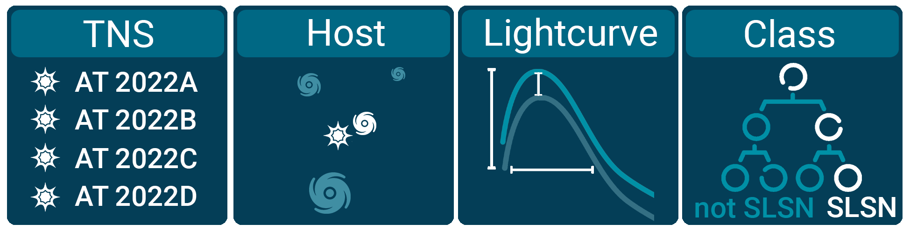

[](https://doi.org/10.5281/zenodo.4013965)

# FLEET
Finding Luminous and Exotic Extragalactic Transients.

<p align="center"></p>

FLEET is a machine learning pipeline designed to predict the probability of transients to be either a superluminous supernova or a tidal disruption event. The original FLEET paper is https://ui.adsabs.harvard.edu/abs/2020ApJ...904...74G/abstract

The paper describing the first two years of operations can be found at https://arxiv.org/abs/2210.10811

The current version found in this repository is an unofficial version of the FLEET 2.0 algorithm described in https://arxiv.org/abs/2210.10810, the final FLEET 2.0 version will be released upon acceptance of this manuscript.

# Setup
In order to use FLEET you will need to have two keys in your system. One to query 3PI, and one to query the TNS. FLEET will search for these files in your home directory:

```
/Users/username/3PI_key.txt
/Users/username/tns_key.txt
```
You can request one from https://mastweb.stsci.edu/ps1casjobs/home.aspx and https://wis-tns.weizmann.ac.il/, respectively.

FLEET needs dust maps to calculate the extinction to each target, for that you will need to install `dustmaps`, in the terminal install through pip:

```
pip install dustmaps
```

And then inside Python import the necessary dust maps and install them in whichever directory your prefer.

```
from dustmaps.config import config
config['data_dir'] = '/path/to/store/maps/in'

import dustmaps.sfd
dustmaps.sfd.fetch()
```

You will also need `mastcasjobs`, it should be installed automatically, but if it doesn't you need to install these two modules:
```	
pip install git+git://github.com/dfm/casjobs@master	
pip install git+git://github.com/rlwastro/mastcasjobs@master	
```	

# Example
Assuming you have your 3PI and TNS keys set up, simply run the `main_assess` function on the transient of your choice.

```
from FLEET.classify import predict_SLSN
P_SLSN = predict_SLSN('ZTF19acaiylt', '08:06:54.3654', '+39:00:23.8252')
```

If you don't have a name AND coordinates, you can specify either of them and the function will search in ZTF and TNS for the name of a corresponding set of coordiantes, or vice-versa. Just keep in mind that it will be a little slower.

The `predict_SLSN` function will generate several folders:
* `catalogs/` has the catalog of nearby sources for each transient
* `lightcurves/` has the appended lists of light curve information for each transient
* `osc/` has the photometry from the Open Supernova Catalog
* `ztf/` has the photometry from ZTF
* `ignore/` is where the individual ignore files are stored
* `photometry/` is where you can store your own photometry
* `plots/` has output light curve and field plots with the models shown

You recommend using `querry_multiple_osc` when running FLEET on several objects. This function will automatically download OSC data in bulk instead of individually querying each object. For example:
```
from FLEET.classify import predict_SLSN
from FLEET.transient import querry_multiple_osc

object_names = ['2020a','2020b','2020c','2020d','2020e']
querry_multiple_osc(','.object_names)

for object_name in object_names:
	predict_SLSN(object_name)
```
If you set `plot_lightcurve = True` this will generate a plot an image of the field, light curve, and corresponding best fit model.

# Modification
We encourage you to modify the `predict_SLSN` function depending on your goals. For example, if you only need part of it, or if you want to run multiple classifiers on a single object.

You can modify the `create_training_testing` function to use a different set of features, depth, seed number, training days, etc. For example something like this would allow you to get errorbars on the predicted probability:
```
p_out = np.array([])
for seed in range(10, 20):
	predicted_probability = create_training_testing(object_name, features_table, clf_state = seed)
	p_out = np..append(p_out, predicted_probability)
average_p = np.mean(p_out)
std_p = np.std(p_out)
```
(this wil be a feature in the future)

### get_transient_info
This function will get all the relevant information for a transient, such as RA, DEC, TNS name, ZTF name, and light curve from the TNS, ZTF, or OSC. If the transient is lower than DEC = -32, FLEET will quit immediately, since this is lower than any 3PI coverage.

### generate_lightcurve
This function will grab everything from `get_transient_info` and generate a single lightcurve file that can be read in without having to re-query all the data every time. `ignore_data` can be run on the output table from `generate_lightcurve` to mark any spurious data points from the light curve as "Ignore". To do this just make a directory called `ignore/` and place files of the format `object_name.txt` where each line is a region bounded by `minMJD maxMJD minMag maxMag` that will be ignored. 

### fit_linex
This function will fit a simple model to the light curve and return all the relevant parameters and light curve information for plotting. Optionally you can run `get_extinction` to apply an extinction correction to the `g` and `r` band points of the light curve. (Applying extinction to other bands will be a feature in the future)

### get_catalog
This function will get the objects from 3PI and SDSS, cross-match them, and generate a single catalog file that can then be read in instead of having to query again. The output can be fed into `catalog_operations` which will calculate the probability of each object to be a galaxy, and correct their `ugrizy` magnitudes for extinction.

### get_best_host
This function will find the most likely host from the catalog file. The best host is the one with the lowest probability of chance coincidence. Objects will be ignored if they have probability of being a galaxy < 10%.

### create_features
This function will generate the set of features that the machine learning classifier will need to predict the class of the transient.

### create_training_testing
This is where the classifier lives. The parameters for the basic `quick`, `redshift`, `late`, and `host` classifiers described in Gomez et al. 2020 are provided in `predict_SLSN`
```
if classifier == 'quick':
    predicted_probability = create_training_testing(object_name, features_table, training_days = 20, model = 'single', clean = 0, feature_set = 13, max_depth = 7)
elif classifier == 'redshift':
    predicted_probability = create_training_testing(object_name, features_table, training_days = 20, model = 'single', clean = 0, feature_set = 16, max_depth = 7)
elif classifier == 'late':
    predicted_probability = create_training_testing(object_name, features_table, training_days = 70, model = 'double', clean = 0, feature_set = 7 , max_depth = 9)
elif classifier == 'host':
    predicted_probability = create_training_testing(object_name, features_table, training_days = 70, model = 'double', clean = 1, feature_set = 7 , max_depth = 9)
```
You can modify these parameters, run multiple at the same time, or run with different seed numbers.
The order of the classes for `predicted_probability` is 
0 = 'Nuclear'
1 = 'SLSN-I'
2 = 'SLSN-II'
3 = 'SNII'
4 = 'SNIIb'
5 = 'SNIIn'
6 = 'SNIa'
7 = 'SNIbc'
8 = 'Star'

### make_plot

This function generates a light curve plot, one zoomed in and one zoomed out. As well as download a small cutout image of the field. It saves the output to the `plots/` folder. For example:
<p align="center"></p>

